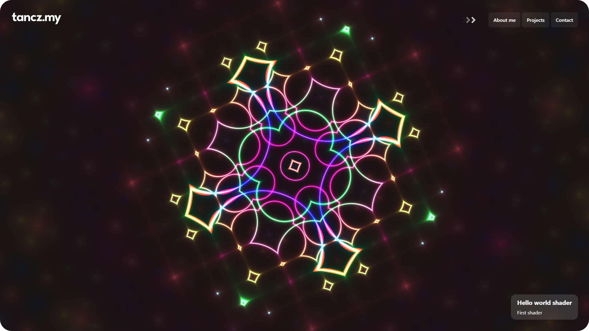

# [tancz.my](https://tancz.my) - personal website

A simple website with WebGL shader showcase made with [shader-doodle](https://github.com/halvves/shader-doodle) and [Shadertoy API](https://www.shadertoy.com/howto).

Logo font is [Nexa](https://www.fontfabric.com/fonts/nexa/)